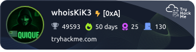

# 👋 ¡Hola! Soy Enrique Forte  

💻 **Estudiante DAM especializado en Java, Python, SQL y Desarrollo de Software**  
🔐 **Master Consultor en Ciberseguridad | Pentesting | Analista | TryHackMe Enthusiast**

---

## 🚀 Sobre mí
- 🌍 Desde Zaragoza, España.  
- 🎓 En proceso de especialización como **Consultor en Ciberseguridad**.
- 🛡️ Experiencia práctica con **TryHackMe** → rutas, máquinas y retos de pentesting.  
- 📈 Interesado en crecer en áreas de **Red Team, Blue Team y Seguridad Ofensiva/Defensiva**.  
- 🔗 [LinkedIn](https://www.linkedin.com/in/enriqueforte/)
- 🔗 [Portfolio — Enrique Forte](https://enriqueforte.web.app)

---

## 🛠️ Tecnologías y herramientas

  
  <!-- Sistemas -->
  
  
  
  
  <!-- Pentesting -->
  
  
  
  
  
  

  <!-- Desarrollo -->
  
  
  
  
  
  
  
  

  <!-- DevOps -->
  
  
  

 <!-- Automatizacion -->
 

---

### 🛡️ Mis estadísticas en TryHackMe

    

---

## 📊 Estadísticas de GitHub

  
  

  

---

## 🎯 Logros y proyectos
- ✅ Proyectos en **Java y SQL** disponibles en mis repositorios.  
- ✅ Desarrollo de aplicaciones como:
  - ✈️ [**Gestión de Vuelos y Pasajeros**](https://github.com/EnriqueForte/GestionVuelosyPasajeros)
  - 🌦️ [**Aplicación Meteorológica**](https://github.com/EnriqueForte/weather-app) 
  - 🛠️ [**Servicio de revisión de código**](https://github.com/EnriqueForte/code-review-service)
  - 🌍 [**Emisiones CO₂**](https://github.com/EnriqueForte/emisiones-co2)
  - 🔗 [**URL Shortener**](https://github.com/EnriqueForte/url-shortener)

---

## 🔧 Herramientas para Ciberseguridad

Aquí encontrarás algunos proyectos y recursos que he creado para aprender y practicar:

- 🛰️ [**Port Scanner en Python**](https://github.com/EnriqueForte/port-scanner-kik3) → Escáner de puertos en **Python** con escaneo básico, rangos de puertos y exportación de resultados. Incluye banner en HTML/CSS.

- 🔐 [**WiFi Guardian (Wi-Fi Scanner)**](https://github.com/EnriqueForte/wifi-guardian) → Vigilancia de red local con escaneo ARP/ICMP, baseline de dispositivos, alias y fabricantes (OUI), detección de ARP spoofing y deauth (Linux). Informe HTML con tema oscuro y buscador. CLI en Python/Typer.

- 🧰 [**Automatizaciones n8n (Monorepo)**](https://github.com/EnriqueForte/automatizaciones-n8n)
  - 🧪 [**VirusTotal_IP_Checker**](https://github.com/EnriqueForte/automatizaciones-n8n/tree/main/VirusTotal_IP_Checker) → Webhook que analiza IPs en **VirusTotal**, resume indicadores (malicious/suspicious/harmless/undetected, reputación, ASN/país) y envía **alertas** (Telegram) + **registro** (Google Sheets). Incluye JSON sanitizado, docs y arquitectura.

---

## 🕵️ CTFs Resueltos (Writeups Terminados)

Aquí encontrarás los writeups de CTFs completamente resueltos, revisados y listos para consultar, agrupados por la **temática principal** que abordaron.

### 🌐 Web Hacking y Servicios

| CTF | Plataforma | Estado |
| :--- | :--- | :---: |
| [🛡️ RCE + SYSTEM - Relevant – TryHackMe ](./CTFs/Relevant/README.md) | TryHackMe | ✅ |
| [🤖💾 Cyborg – TryHackMe ](./CTFs/Cyborg/README.md) | TryHackMe | ✅ |
| [🔑💻 Overpass – TryHackMe](./CTFs/OverPass/README.md) | TryHackMe | ✅ |
| [💻🐘 Lazy Admin (SweetRice CMS) – TryHackMe](./CTFs/LazyAdmin/README.md) | TryHackMe | ✅ |
| [📂 Include – TryHackMe](./CTFs/Include/README.md) | TryHackMe | ✅ |
| [💉 Injectics – TryHackMe](./CTFs/Injectics/README.md) | TryHackMe | ✅ |
| [🥒 Pickle Rick – TryHackMe](./CTFs/Pickle%20Rick/README.md) | TryHackMe | ✅ |

### 👑 Infraestructura y Active Directory

| CTF | Plataforma | Estado |
| :--- | :--- | :---: |
| [🍲💻 Soupedecode01 – TryHackMe](./CTFs/Soupedecode01/README.md) | TryHackMe | ✅ |
| [🏢🔐 Attacktive Directory – TryHackMe](./CTFs/AttacktiveDirectory/README.md) | TryHackMe | ✅ |
| [🛠️💻 Toolsrus – TryHackMe](./CTFs/ToolsRus/README.md) | TryHackMe | ✅ |

### 🛡️ Escalamiento de Privilegios y Misceláneo

| CTF | Plataforma | Estado |
| :--- | :--- | :---: |
| [🖼️🕵️ Brooklyn Nine Nine – TryHackMe ](./CTFs/BrooklynNineNine/README.md) | TryHackMe | ✅ |
| [🤖💻 Skynet: The Judgment Day – TryHackMe](./CTFs/Skynet/README.md) | TryHackMe | ✅ |
| [🐇👑 Wonderland – TryHackMe](./CTFs/Wonderland/README.md) | TryHackMe | ✅ |
| [🔐 Agent Sudo – TryHackMe](./CTFs/AgentSudo/README.md) | TryHackMe | ✅ |
| [🔨 Hammer – TryHackMe](./CTFs/Hammer/README.md) | TryHackMe | ✅ |
| [🏴‍☠️ Bounty Hacker – TryHackMe](./CTFs/Bounty%20Hacker/README.md) | TryHackMe | ✅ |
| [🧩🔑 Crack The Hash – TryHackMe](./CTFs/CrackTheHash/README.md) | TryHackMe | ✅ |
| [🧩 SimpleCTF – TryHackMe](./CTFs/SimpleCTF/README.md) | TryHackMe | ✅ |
| [🏴‍☠️ El Bandito – TryHackMe](./CTFs/ElBandito/README.md) | TryHackMe | ✅ |

### 🔍 OSINT y Forense

| CTF | Plataforma | Estado |
| :--- | :--- | :---: |
| [🕵️‍♀️💻 Investigating Windows – TryHackMe](./CTFs/InvestigatingWindows/README.md) | TryHackMe | ✅ |
| [🕵️ What's Your Name? – TryHackMe](./CTFs/Whats%20Your%20Name%3F/README.md) | TryHackMe | ✅ |

---

## 🚧 CTFs en Preparación (Walkthrough Pendiente)

Estos writeups están actualmente **en proceso de creación o revisión**. Los iré moviendo a la sección superior una vez estén completos.

### TryHackMe

- [🤖 Mr. Robot – TryHackMe](./CTFs/MrRobot/README.md)
- [🌐 Basic Pentesting – TryHackMe](./CTFs/BasicPentesting/README.md)
- [🕵️ OhSINT – TryHackMe](./CTFs/OhSINT/README.md)
- [🛡️ Vulnerability Capstone – TryHackMe](./CTFs/VulnerabilityCapstone/README.md)
- [📂 RootMe – TryHackMe](./CTFs/RootMe/README.md)
- [🔐 Net Sec Challenge – TryHackMe](./CTFs/NetSecChallenge/README.md)

### DockerLabs

- [🌀 Psycho – DockerLabs](./CTFs/Psycho/README.md)
