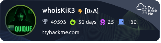

# 👋 ¡Hola! Soy Enrique Forte  

💻 **Técnico Superior en Desarrollo de Aplicaciones Multiplataforma**  

🔐 **Máster Consultor en Ciberseguridad | Pentesting | Analista en Ciberseguridad | Alumno en HACK4U**

---

## 🚀 Sobre mí
- 🌍 Desde Zaragoza, España.  
- 🎓 En proceso de especialización como **Analista en Ciberseguridad**.
- 🛡️ Experiencia práctica con **TryHackMe** → rutas, máquinas y retos de pentesting.  
- 📈 Interesado en crecer en áreas de **Red Team, Blue Team y Seguridad Ofensiva/Defensiva**.  
- 🔗 [LinkedIn](https://www.linkedin.com/in/enriqueforte/)
- 🔗 [Portfolio — Enrique Forte](https://enriqueforte.web.app)

---

## 🛠️ Tecnologías y herramientas
<p align="left">

  <!-- Sistemas -->
  
  
  

  <!-- QA Automation -->
  
  
  

  <!-- Pentesting / Security Testing -->
  
  
  
  
  

  <!-- Desarrollo -->
  
  
    
  
  
  
  

  <!-- DevOps / CI -->
  
  
  
  
  
  

  <!-- Reporting / Dashboards -->
  
  

  <!-- Automatización -->
  
</p>

---

### 🛡️ Mis estadísticas en TryHackMe
<p align="center">
    
</p>

---

## 📊 GitHub Activity

<p align="center">
  
  
</p>

---

## 🎯 Logros y proyectos
- ✅ Proyectos en **Java y SQL** disponibles en mis repositorios.  
- ✅ Desarrollo de aplicaciones como:
  - ✈️ [**Gestión de Vuelos y Pasajeros**](https://github.com/EnriqueForte/GestionVuelosyPasajeros)
  - 🌦️ [**Aplicación Meteorológica**](https://github.com/EnriqueForte/weather-app) 
  - 🛠️ [**Servicio de revisión de código**](https://github.com/EnriqueForte/code-review-service)
  - 🌍 [**Emisiones CO₂**](https://github.com/EnriqueForte/emisiones-co2)
  - 🔗 [**URL Shortener**](https://github.com/EnriqueForte/url-shortener)

---

## 🔧 Herramientas y Laboratorios de Ciberseguridad

Aquí encontrarás algunos proyectos y recursos que he creado para aprender y practicar:

- 🛰️ [**Port Scanner en Python**](https://github.com/EnriqueForte/port-scanner-kik3) → Escáner de puertos en **Python** con escaneo básico, rangos de puertos y exportación de resultados. Incluye banner en HTML/CSS.

- 🔐 [**WiFi Guardian (Wi-Fi Scanner)**](https://github.com/EnriqueForte/wifi-guardian) → Vigilancia de red local con escaneo ARP/ICMP, baseline de dispositivos, alias y fabricantes (OUI), detección de ARP spoofing y deauth (Linux). Informe HTML con tema oscuro y buscador. CLI en Python/Typer.

- 🧰 [**Automatizaciones n8n (Monorepo)**](https://github.com/EnriqueForte/automatizaciones-n8n)
  - 🧪 [**VirusTotal_IP_Checker**](https://github.com/EnriqueForte/automatizaciones-n8n/tree/main/VirusTotal_IP_Checker) → Webhook que analiza IPs en **VirusTotal**, resume indicadores (malicious/suspicious/harmless/undetected, reputación, ASN/país) y envía **alertas** (Telegram) + **registro** (Google Sheets). Incluye JSON sanitizado, docs y arquitectura.
  - 🛡️ [**IP_Reputation_Tracker**](https://github.com/EnriqueForte/automatizaciones-n8n/tree/main/IP_Reputation_Tracker) → Automatización que obtiene IPs desde **Google Sheets**, consulta su reputación en **AbuseIPDB**, lanza **alertas por Telegram** si el `abuseConfidenceScore` supera un umbral, registra los resultados en **Sheets** y envía un **informe HTML diario** por **Gmail**. Incluye workflow sanitizado, documentación y carpeta de capturas.

- 🤖 [**QA-Automation-Ciberseguridad (Monorepo)**](https://github.com/EnriqueForte/QA-Automation-Ciberseguridad)
  - 🧠 [**Playwright Security Lab**](https://github.com/EnriqueForte/QA-Automation-Ciberseguridad/tree/main/Playwright_Security_Lab) → Laboratorio automatizado con **Playwright** que compara entornos *Secure* vs *Insecure*, validando encabezados de seguridad (CSP, HSTS, X-Frame-Options), HTTPS, y buenas prácticas OWASP. Genera **reportes automáticos**, análisis comparativo y logs detallados de vulnerabilidades detectadas.
 
- 🧪 [**RedTeamLab SQLi (Local Web Lab)**](https://github.com/EnriqueForte/redteamlab-sqli)
  - 🔓 [**SQL Injection Lab (Login Bypass + UNION Dump)**](https://github.com/EnriqueForte/redteamlab-sqli/tree/main/lab) → Laboratorio **educativo y local** en **PHP + MariaDB** para practicar SQLi de forma manual: **Authentication Bypass** en `login.php` y explotación **Boolean-based + UNION-based + GROUP_CONCAT** en `searchUsers`. Incluye **capturas**, endpoint indexado y roadmap para versión *Secure* con *prepared statements*.

---

## 🕵️ CTFs Resueltos

Aquí encontrarás los writeups de CTFs completamente resueltos, revisados y listos para consultar, agrupados por la **temática principal** que abordaron.

### 🌐 Web Hacking, Servicios y Escalada de Privilegios

| CTF | Plataforma | Estado |
| :--- | :--- | :---: |
| [🧊❄️ ChillHack – TryHackMe](./CTFs/ChillHack/README.md) | TryHackMe | ✅ |
| [🔥💥 Ignite – TryHackMe](./CTFs/Ignite/README.md) | TryHackMe | ✅ |
| [💼💻 Billing – TryHackMe](./CTFs/Billing/README.md) | TryHackMe | ✅ |
| [🔬🖥️ UltraTech – TryHackMe](./CTFs/UltraTech/README.md) | TryHackMe | ✅ |
| [💻📚 Blog – TryHackMe](./CTFs/Blog/README.md) | TryHackMe | ✅ |
| [🐕🐈💻 Dogcat – TryHackMe](./CTFs/DogCat/README.md) | TryHackMe | ✅ |
| [🛡️ RCE + SYSTEM - Relevant – TryHackMe ](./CTFs/Relevant/README.md) | TryHackMe | ✅ |
| [🤖💾 Cyborg – TryHackMe ](./CTFs/Cyborg/README.md) | TryHackMe | ✅ |
| [🔑💻 Overpass – TryHackMe](./CTFs/OverPass/README.md) | TryHackMe | ✅ |
| [💻🐘 Lazy Admin (SweetRice CMS) – TryHackMe](./CTFs/LazyAdmin/README.md) | TryHackMe | ✅ |
| [📂 Include – TryHackMe](./CTFs/Include/README.md) | TryHackMe | ✅ |
| [💉 Injectics – TryHackMe](./CTFs/Injectics/README.md) | TryHackMe | ✅ |
| [🥒 Pickle Rick – TryHackMe](./CTFs/Pickle%20Rick/README.md) | TryHackMe | ✅ |
| [🌐 Basic Pentesting – TryHackMe](./CTFs/BasicPentesting/README.md) | TryHackMe | 🔜 |
| [🛡️ Vulnerability Capstone – TryHackMe](./CTFs/VulnerabilityCapstone/README.md) | TryHackMe | 🔜 |

### 👑 Infraestructura y Active Directory

| CTF | Plataforma | Estado |
| :--- | :--- | :---: |
| [🛡️🔥 VulNet:Roasted – TryHackMe](./CTFs/VulNet/README.md) | TryHackMe | ✅ |
| [🍲💻 Soupedecode01 – TryHackMe](./CTFs/Soupedecode01/README.md) | TryHackMe | ✅ |
| [🏢🔐 Attacktive Directory – TryHackMe](./CTFs/AttacktiveDirectory/README.md) | TryHackMe | ✅ |
| [🛠️💻 Toolsrus – TryHackMe](./CTFs/ToolsRus/README.md) | TryHackMe | ✅ |
| [🔗 Net Sec Challenge – TryHackMe](./CTFs/NetSecChallenge/README.md) | TryHackMe | 🔜 |
| [🌀 Psycho – DockerLabs](./CTFs/Psycho/README.md) | DockerLabs | 🔜 |

### 🛡️ Escalamiento de Privilegios y Misceláneo

| CTF | Plataforma | Estado |
| :--- | :--- | :---: |
| [💣🐚 0day – TryHackMe](./CTFs/0day/README.md) | TryHackMe | ✅ |
| [🐧📥 Wgel CTF – TryHackMe](./CTFs/WgelCTF/README.md) | TryHackMe | ✅ |
| [🧨💥 Brute It – TryHackMe](./CTFs/BruteIt/README.md) | TryHackMe | ✅ |
| [🦇👻 TomGhost – TryHackMe](./CTFs/TomGhost/README.md) | TryHackMe | ✅ |
| [🎛️🔑 Kenobi - TryHackMe](./CTFs/Kenobi/README.md) | TryHackMe | ✅ |
| [💻📚 Startup - TryHackMe](./CTFs/Startup/README.md) | TryHackMe | ✅ |
| [🧩🔐 Smol - TryHackMe](./CTFs/Smol/README.md) | TryHackMe | ✅ |
| [🔒 Expressway - HackTheBox](./CTFs/Expressway/README.md) | HackTheBox | ✅ |
| [🖥️ Anonymous – TryHackMe](./CTFs/Anonymous/README.md) | TryHackMe | ✅ |
| [🖼️🕵️ Brooklyn Nine Nine – TryHackMe ](./CTFs/BrooklynNineNine/README.md) | TryHackMe | ✅ |
| [🤖💻 Skynet: The Judgment Day – TryHackMe](./CTFs/Skynet/README.md) | TryHackMe | ✅ |
| [🐇👑 Wonderland – TryHackMe](./CTFs/Wonderland/README.md) | TryHackMe | ✅ |
| [🔐 Agent Sudo – TryHackMe](./CTFs/AgentSudo/README.md) | TryHackMe | ✅ |
| [🔨 Hammer – TryHackMe](./CTFs/Hammer/README.md) | TryHackMe | ✅ |
| [🏴‍☠️ Bounty Hacker – TryHackMe](./CTFs/Bounty%20Hacker/README.md) | TryHackMe | ✅ |
| [🧩🔑 Crack The Hash – TryHackMe](./CTFs/CrackTheHash/README.md) | TryHackMe | ✅ |
| [🧩 SimpleCTF – TryHackMe](./CTFs/SimpleCTF/README.md) | TryHackMe | ✅ |
| [🏴‍☠️ El Bandito – TryHackMe](./CTFs/ElBandito/README.md) | TryHackMe | ✅ |
| [🧭 Mr. Robot – TryHackMe](./CTFs/MrRobot/README.md) | TryHackMe | 🔜 |
| [📂 RootMe – TryHackMe](./CTFs/RootMe/README.md) | TryHackMe | 🔜 |

### 🔍 OSINT y Forense

| CTF | Plataforma | Estado |
| :--- | :--- | :---: |
| [🕵️‍♂️💾 Autopsy & Disk Analysis: Caso Forense TryHackMe](./CTFs/DiskAnalysisAndAutopsy/README.md) | TryHackMe | ✅ |
| [🕵️‍♀️💻 Investigating Windows – TryHackMe](./CTFs/InvestigatingWindows/README.md) | TryHackMe | ✅ |
| [🕵️ What's Your Name? – TryHackMe](./CTFs/Whats%20Your%20Name%3F/README.md) | TryHackMe | ✅ |
| [🕵️ OhSINT – TryHackMe](./CTFs/OhSINT/README.md) | DockerLabs | 🔜 |

### 💥 Buffer Overflow y Explotación de Memoria

| CTF | Plataforma | Estado |
| :--- | :--- | :---: |
| [🧠💥 Flag Vault 2 - TryHackMe](./CTFs/FlagVault2/README.md) | TryHackMe | ✅ |
| [🧠💥 Flag Vault - TryHackMe](./CTFs/FlagVault/README.md) | TryHackMe | ✅ |

---

### 🧩 Total General

| 📊 Tipo | 🧠 Cantidad |
| :--- | :---: |
| ✅ **CTFs completados y documentados** | **40** |
| 🔜 **CTFs completados (walkthrough pendiente)** | **7** |
| 💯 **Total CTFs realizados** | **47** |

---

### 🎯 Resumen Visual

```text
🌐 Web ................. 🟩🟩🟩🟩🟩🟩🟩🟩🟩  (15/15)
👑 Infraestructura ..... 🟩🟩🟩🟩🟩       (6/6)
🛡️ Privilegios ......... 🟩🟩🟩🟩🟩🟩🟩🟩🟩🟩🟩🟩  (20/20)
🔍 OSINT ............... 🟩🟩🟩            (4/4)
💥 Buffer Overflow ..... 🟩 (2/2)
````
---
